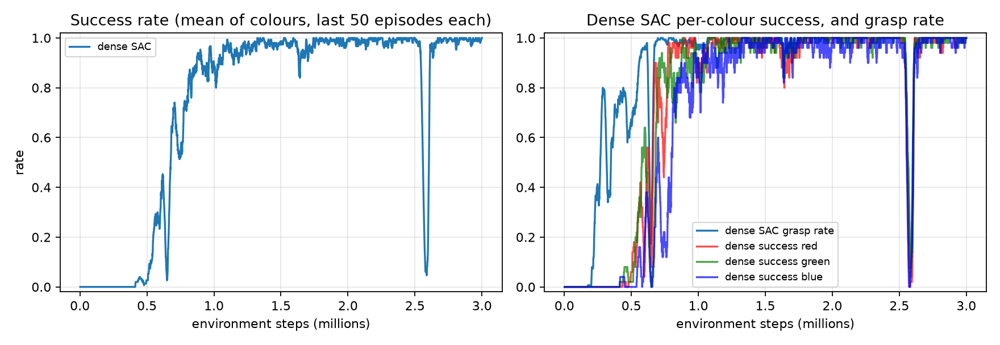

# 43008: Reinforcement Learning
## Assignment 3, Part-C — Initial Experimental Results

**Project Title and number (Refer to Dashboard):** ShelfSort-RL: Reward Shaping for Robotic Category Sorting

**Team Name:** dotRAR

**Team Members:**

| Student Name | Student ID | Email ID |
|---|---|---|
| Van An Hoang | 26046146 | vanan.hoang@student.uts.edu.au |
| Tinnapat Plangsri | 25746381 | tinnapat.plangsri@student.uts.edu.au |
| Warit Srichairattanakul | 25745973 | warit.srichairattanakul@student.uts.edu.au |

---

## Algorithms/Methods Chosen

**Type:** model-free deep reinforcement learning for continuous control. We compare one on-policy and one off-policy actor-critic method, both from Stable-Baselines3.

- **Proximal Policy Optimisation (PPO)** (Schulman et al., 2017) is an on-policy actor-critic method. It maximises a clipped surrogate objective with GAE advantages, which keeps each update close to the previous policy and makes training stable without heavy tuning. It is a standard baseline for robot manipulation.
- **Soft Actor-Critic (SAC)** (Haarnoja et al., 2018) is an off-policy actor-critic method. It maximises reward plus the entropy of the policy, with the entropy weight tuned automatically, and learns from a replay buffer of past experience, so each transition can be reused many times.

The policy controls a simulated SO-ARM101 arm in MuJoCo. This report compares the two algorithms on the **dense (shaped) reward**: the environment, observations, reward, success rule and training budget (3M environment steps) are identical for both. The reward is:

- **Dense (shaped):** +1 when the block is correctly placed, plus shaping terms that reward progress in reaching, grasping, lifting, carrying and lowering the block, and a small step penalty. The terms are differences of distance or height ($\Phi(s') - \Phi(s)$), in the spirit of potential-based shaping (Ng et al., 1999).

To check feasibility, scripted pick-and-place controllers were run before training. Trained policies were replayed step by step to diagnose failures and reward hacking.

## Experimental Settings

**Task:** pick a red, green or blue block (colour random each episode) from a fixed supply pad and place it on the shelf zone of the same colour. The zones are 0.11 m (red), 0.23 m (green) and 0.33 m (blue) from the pad. The arm pose and block start position are fixed.

**Table 1. Problem formulation, PPO and SAC settings**

| Setting | Value |
|---|---|
| Observation (21-D) | Joint pos/vel (12), end-effector pos (3), block pos (3), target shelf pos (3) |
| Action (4-D, [−1, 1]) | End-effector displacement (≤ 2 cm per step, converted to joint targets by IK) + gripper open/close |
| Episode | ≤ 200 steps; ends on success |
| Success | Block within 3 cm of the zone, resting on the table, and released |
| PPO | MLP 64×64, learning rate $3\times10^{-4}$, rollout 2048 steps, batch 64, 10 epochs, $\gamma = 0.99$, $\lambda = 0.95$, clip $\varepsilon = 0.2$, no entropy bonus |
| SAC | MLP 256×256, learning rate $3\times10^{-4}$, replay buffer $10^6$, batch 256, $\tau = 0.005$, $\gamma = 0.99$, automatic entropy tuning, 1 gradient step per vectorised env step (≈ 0.75M updates in total) |
| Budget | 3M steps per run, seed 0. PPO: 1 env (~92 min on a laptop CPU). SAC: 4 parallel envs (~91 min on a laptop CPU) |

Both algorithms use the Stable-Baselines3 default hyperparameters; the only training-side difference we chose is SAC's 4 parallel environments, which keep its wall-clock time close to PPO's.

**Table 2. Dense reward function (per step)**

| Term | Dense |
|---|---|
| Correct placement | +1.0 |
| Reach: gripper moves closer to block | $2.0\,\Delta d_{\text{reach}}$ |
| Grasp: first time block is held | +0.5 (once) |
| Transport: held block moves closer to shelf | $5.0\,\Delta d_{\text{transport}}$ |
| Height: carry 5 cm high when far, lower over the target | $10.0\,\Delta\Phi_h$ |
| Step penalty | −0.001 |

The full dense reward at step $t$ is

$$
r_t = \mathbb{1}_{\text{success}} + 2\,\Delta d_{\text{reach}} + 0.5\,\mathbb{1}_{\text{first grasp}} + 5\,\mathbb{1}_{\text{grasped}}\,\Delta d_{\text{transport}} + 10\,\Delta\Phi_h - 0.001
$$

where $\Delta d = d_{t-1} - d_t$ is the decrease in a distance over one step, and the height potential is

$$
\Phi_h = -\left|\, \min\!\big(z_{\text{lift}},\, 0.05\big) - z^{*} \right|,
\qquad
z^{*} = 0.05\,\operatorname{clip}\!\left(\frac{d_{xy} - 0.03}{0.05},\, 0,\, 1\right)
$$

with $z_{\text{lift}}$ the block's height above its resting position and $d_{xy}$ its horizontal distance to the target. $z^{*}$ is the desired lift: 5 cm while far from the target, falling to 0 within 3 cm of it, so lowering the block over the target is rewarded.

## Initial Results

Both algorithms were trained for 3M steps on the dense reward with the settings above (Table 3, Figure 1).

**Table 3. PPO vs SAC on the dense reward after 3M steps (stochastic policy, last 50 training episodes per colour)**

| Metric | Dense PPO | Dense SAC |
|---|---|---|
| Success rate (mean) | 0.79 | **1.00** |
| Success: red / green / blue | 0.84 / 0.86 / 0.68 | 1.00 / 1.00 / 1.00 |
| Grasp rate (final / peak) | 0.99 / 1.00 | 1.00 / 1.00 |
| Steps to first success | **86k** | 414k |
| Steps to 50% success: red / green / blue | 0.86M / 1.30M / 2.30M | **0.62M / 0.58M / 0.69M** |
| Mean episode length | 137 | **52** |



**Figure 1.** Dense SAC training curves (seed 0). Left: success rate, mean of the three colours over the last 50 episodes of each. Right: per-colour success and grasp rate. The matching PPO curves are in the dense-vs-sparse figure of our PPO experiments.

**Table 4. Final dense policies evaluated on 300 new episodes**

| Algorithm | Action mode | Red | Green | Blue | Mean | Avg. steps to place (R / G / B) |
|---|---|---|---|---|---|---|
| PPO | Deterministic | 1.00 | 1.00 | 1.00 | 1.00 | 61 / 132 / 124 |
| PPO | Stochastic | 0.82 | 0.81 | 0.75 | 0.79 | 80 / 119 / 153 |
| SAC | Deterministic | 1.00 | 1.00 | 1.00 | 1.00 | 34 / 51 / 61 |
| SAC | Stochastic | 1.00 | 1.00 | 0.98 | 0.99 | 36 / 53 / 61 |

The SAC evaluation used 99 red, 95 green and 106 blue episodes.

**Table 5. Failure modes found while developing the dense reward and training SAC**

| Version | Behaviour | Cause | Fix |
|---|---|---|---|
| v2 (PPO) | Throws the block at the nearest zone (red only) | Gripper collision mesh could not hold the block (physics bug) | Box pads on the jaw faces |
| v4 (PPO) | Holds the block until timeout | Per-step hold bonus made stalling pay | Remove hold bonus |
| v5 (PPO) | Hovers above the target, never lowers | Lift term penalised lowering everywhere | Height target drops to 0 over the zone |
| SAC, 0.75M–2.0M steps | Deterministic success on 60-episode checks swings between 0.67 and 1.00: one colour fails with the mean action while the stochastic policy still places it (e.g. 1.5M checkpoint: deterministic 0.67 with green 0.00, stochastic 0.93) | Mean action still unreliable for one colour mid-training | None needed: stable at 1.00 from 2.25M steps on; save checkpoints and evaluate them |
| SAC, 2.59M steps | Training success drops from ~1.00 to 0.05, then recovers to 0.91 within 25k steps | Brief instability, not diagnosed | None needed for this run; a reason to keep checkpoints |

## Findings

- **SAC learned the task faster and more reliably than PPO.** At the same 3M-step budget, SAC's stochastic policy reached 1.00 success against PPO's 0.79, and reached 50% on every colour by 0.69M steps. PPO needed 2.30M steps to reach 50% on blue, so SAC got there about 3.3× faster for the hardest colour. SAC also learned all three colours at almost the same time, whereas PPO learned them in order of distance (red, green, then blue).
- **SAC's policies are faster and less sensitive to action noise.** SAC places the block in about half the steps (34 / 51 / 61 vs 61 / 132 / 124 deterministic), and its stochastic policy is almost as good as its deterministic one (0.99 vs 1.00). PPO loses 21 points when actions are sampled (0.79 vs 1.00).
- **PPO found its first success sooner.** PPO's first placement came at 86k steps, SAC's at 414k. SAC was already grasping by about 0.2M steps (Figure 1), but needed more steps before the first full placement; after that it improved much faster than PPO.
- **SAC training was not perfectly stable.** Its deterministic success on saved checkpoints swung between 0.67 and 1.00 until 2.0M steps, and training success briefly collapsed to 0.05 at 2.59M steps before recovering. The final policy was unaffected, but on another seed the final weights could land in such a dip, so checkpointing matters.
- **The comparison is not fully controlled.** Both algorithms used Stable-Baselines3 defaults, so SAC had a larger network (256×256 vs 64×64) and 4 parallel environments vs PPO's 1. The step budget and wall-clock time (~91 vs ~92 min) are matched, but the network size alone could explain part of the gap.
- **Limitations and next steps:** these are single-seed results. Because only the colour changes between episodes, a deterministic 100% replays three fixed paths and does not show generalisation. Next steps: 3+ seeds per algorithm, matching network sizes, the sparse-reward condition for SAC, and randomised start positions.

## Reproducing the results

```bash
git checkout sac-on-main
uv run python -m shelfsort.train --reward-mode dense --algo sac --n-envs 4 --timesteps 3000000 --checkpoint-every 250000 --out runs/main_sac
uv run python -m shelfsort.evaluate --model runs/main_sac/models/dense_seed0_sac.zip --episodes 300
uv run --with matplotlib python -m shelfsort.report --runs runs/main_sac --out docs/report_sac
uv run mjpython -m shelfsort.play --model runs/main_sac/models/dense_seed0_sac.zip
```

## References

Haarnoja, T., Zhou, A., Abbeel, P., & Levine, S. (2018). Soft actor-critic: Off-policy maximum entropy deep reinforcement learning with a stochastic actor. *Proc. ICML*, 1861–1870.

Ng, A. Y., Harada, D., & Russell, S. (1999). Policy invariance under reward transformations: Theory and application to reward shaping. *Proc. ICML*, 278–287.

Schulman, J., Wolski, F., Dhariwal, P., Radford, A., & Klimov, O. (2017). Proximal policy optimization algorithms. *arXiv:1707.06347*.
